# Math Fluency App — Animation & System Flow

*This document contains both the animated system storyboard and the SwiftUI prototype for visualizing live sessions.*

---

## D) Animated System Flow (Storyboard Preview)

```mermaid
sequenceDiagram
  participant User as 🧠 Student
  participant Practice as Practice Mode
  participant Timed as Timed Mode
  participant Adaptive as Adaptive Engine
  participant Progress as Progress View

  User->>Practice: Enters Practice Mode
  Practice->>User: Prompt fact (e.g., 8 + 6)
  User->>Practice: Typed answer
  alt Correct
    Practice->>Adaptive: Log success + timing
    Adaptive->>Progress: Update mastery wheel
  else Wrong
    Practice->>User: Show 2-step micro-lesson
    User->>Practice: Retry near-twin
    Practice->>Adaptive: Log miss + retry data
  end
  loop Until Goal Reached or 60s Elapse
    User->>Timed: Start Timed Quiz
    Timed->>User: Show 2×2 grid question
    User->>Timed: Select answer
    Timed->>Adaptive: Send correct/incorrect + RT
    Adaptive->>Progress: Increment leaderboard stats
  end
  Progress->>User: Display streaks, badges, PB+2 goal prompt
```



**Animation concept:**

- Facts pulse from **Adaptive → Practice/Timed** every few seconds.
- Correct answers trigger green flashes; wrong answers show a quick red bounce and branch to the coaching flow.
- The **timer bar** animates across 60s, shrinking with easing.
- Leaderboard digits roll up like an odometer.
- Progress wheels fill dynamically at the end.

---

## E) SwiftUI Animation Prototype (Timer, Feedback, Progress)

```swift
import SwiftUI

// MARK: - Animated Timed Session Demo
// Shows: (1) 60s animated timer ring + monospaced seconds
//        (2) Correct/incorrect flash feedback
//        (3) Rolling score (odometer‑style)
//        (4) Progress wheel that fills on finish

struct AnimatedTimedSessionView: View {
  @State private var timeLeft: Double = 60
  @State private var isRunning = false
  @State private var score = 0
  @State private var flash: FlashKind? = nil
  @State private var progress: Double = 0 // 0..1 progress wheel at end

  private let timer = Timer.publish(every: 1/30, on: .main, in: .common).autoconnect()

  var body: some View {
    VStack(spacing: 24) {
      // Timer Ring + Seconds
      ZStack {
        Circle()
          .stroke(lineWidth: 16)
          .foregroundStyle(.thinMaterial)
          .frame(width: 200, height: 200)

        Circle()
          .trim(from: 0, to: max(0, timeLeft/60))
          .stroke(style: StrokeStyle(lineWidth: 16, lineCap: .round))
          .rotationEffect(.degrees(-90))
          .animation(.easeInOut(duration: 0.35), value: timeLeft)
          .foregroundStyle(.tint)
          .frame(width: 200, height: 200)

        Text("\(Int(ceil(timeLeft)))s")
          .font(.system(size: 56, weight: .bold, design: .rounded).monospacedDigit())
          .contentTransition(.numericText())
      }
      .overlay(alignment: .topTrailing) {
        RollingNumberText(value: score)
          .padding(8)
          .background(.ultraThinMaterial, in: Capsule())
          .padding(.trailing, 8)
      }

      LazyVGrid(columns: [GridItem(.flexible()), GridItem(.flexible())], spacing: 12) {
        ForEach(0..<4) { i in
          Button(action: { tappedAnswer(i) }) {
            Text("\([7, 14, 15, 16][i])")
              .font(.system(size: 28, weight: .semibold))
              .frame(maxWidth: .infinity, minHeight: 64)
          }
          .buttonStyle(.borderedProminent)
          .overlay(feedbackOverlay)
        }
      }
      .padding(.horizontal)

      HStack(spacing: 12) {
        Button(isRunning ? "Pause" : "Start") { isRunning.toggle() }
          .buttonStyle(.borderedProminent)
        Button("Reset") { reset() }
          .buttonStyle(.bordered)
      }

      ProgressWheel(progress: progress)
        .frame(width: 140, height: 140)
        .opacity(progress > 0 ? 1 : 0.15)
        .animation(.easeInOut, value: progress)
    }
    .padding()
    .onReceive(timer) { _ in tick() }
    .background(backgroundFlash)
    .animation(.easeOut(duration: 0.25), value: flash)
  }

  private var feedbackOverlay: some View {
    RoundedRectangle(cornerRadius: 18)
      .strokeBorder(flash == .correct ? Color.green : (flash == .wrong ? Color.red : .clear), lineWidth: 3)
      .opacity(flash == nil ? 0 : 1)
  }

  private var backgroundFlash: some View {
    (flash == .correct ? Color.green.opacity(0.12) : (flash == .wrong ? Color.red.opacity(0.12) : Color.clear))
      .ignoresSafeArea()
  }

  private func tappedAnswer(_ index: Int) {
    if index == 2 { score += 1; flash = .correct } else { flash = .wrong }
    DispatchQueue.main.asyncAfter(deadline: .now() + 0.25) { flash = nil }
  }

  private func tick() {
    guard isRunning else { return }
    if timeLeft > 0 { timeLeft -= 1/30 } else {
      isRunning = false
      timeLeft = 0
      withAnimation(.spring(response: 0.8, dampingFraction: 0.7)) {
        progress = min(1, Double(score)/20)
      }
    }
  }

  private func reset() {
    withAnimation { timeLeft = 60 }
    isRunning = false
    score = 0
    flash = nil
    progress = 0
  }
}

private enum FlashKind { case correct, wrong }

struct RollingNumberText: View {
  var value: Int
  var body: some View {
    HStack(spacing: 4) {
      Image(systemName: "bolt.fill").imageScale(.small)
      Text("Score:").font(.callout)
      Text("\(value)")
        .font(.title3.monospacedDigit())
        .contentTransition(.numericText(value: Double(value)))
    }
  }
}

struct ProgressWheel: View {
  var progress: Double
  var body: some View {
    ZStack {
      Circle().stroke(lineWidth: 12).foregroundStyle(.thinMaterial)
      Circle()
        .trim(from: 0, to: progress)
        .stroke(style: StrokeStyle(lineWidth: 12, lineCap: .round))
        .rotationEffect(.degrees(-90))
        .foregroundStyle(Gradient(colors: [.green, .blue]))
        .animation(.easeInOut(duration: 0.6), value: progress)
      Text("\(Int(progress*100))%")
        .font(.headline.monospacedDigit())
        .contentTransition(.numericText())
    }
  }
}

struct AnimatedTimedSessionView_Previews: PreviewProvider {
  static var previews: some View {
    AnimatedTimedSessionView()
      .tint(Color(hue: 0.35, saturation: 0.9, brightness: 0.9))
      .padding()
      .previewLayout(.sizeThatFits)
  }
}
```

**Implementation Notes**

- Present `AnimatedTimedSessionView()` as a hidden dev toggle or test harness.
- Replace mock answers with the adaptive queue logic.
- Add haptics via `UINotificationFeedbackGenerator` and speech prompts via `AVSpeechSynthesizer` for full effect.

