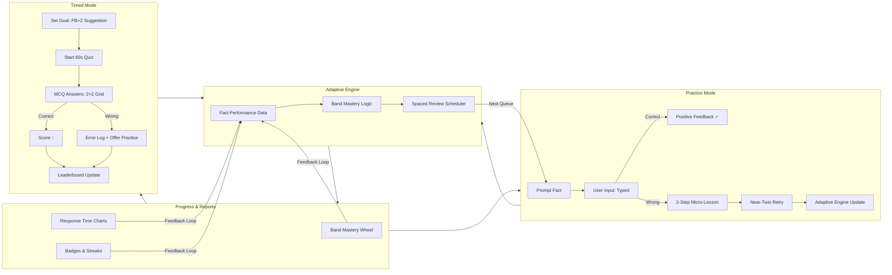

# Second-Grade Math Fluency App — PRD & Design (v1)

*Last updated: 2025‑10‑22*

---

## 1) Purpose & Outcomes

**Purpose.** Build a delightful practice + timed‑quiz app that lifts a second‑grader to fluent, automatic recall of addition/subtraction 0–20 (no negative results).

**Student outcomes.**

- **Accuracy ≥ 95%** on mixed +/– facts 0–20
- **Automaticity:** median response time ≤ **2.0s** per fact in practice; **≥ X correct in 60s** in timed mode (student‑set goal)
- **Retention:** no regression beyond **one level** after 7 idle days (via spaced review)

**Parent outcomes.**

- See progress by **fact family**, **strategy**, and **time‑on‑task**; export/share progress.

---

## 2) Scope (MVP → v1)

**In.** Addition/subtraction 0–20; practice (guided & adaptive, **typed input**); 60‑sec timed quizzes (**multiple‑choice with 4 options**); student goals; per‑person & combined leaderboard; error explanations; targeted practice hand‑off; session cap at 30 minutes per goal attempt; **commutativity checks** (e.g., 6+8 and 8+6 appear separately in timed mode and periodically in practice).

**Out (MVP).** Multiplication/division; multi‑user cloud sync; classroom sync; web leaderboard. (Design for later.)

---

## 3) Learning Model (research‑backed)

Retrieval practice, spacing, interleaving, worked examples, and mastery learning drive the instructional design. Implementation mirrors these through adaptive fact queues, micro‑lessons, and mastery gates.

---

## 4) Content Map (facts & strategies)

Six learning **bands** scaffold from doubles and near‑doubles to complex decompositions, all tagged by **strategy hints** and **fact families** for adaptive reuse.

---

## 5) Modes & Flows

### Practice Mode

- Typed keypad or keyboard input
- Immediate feedback, 2‑step micro‑lesson on misses
- Near‑twin retry + optional targeted drill
- Smart commutativity checks and spaced review

### Timed Mode

- 60‑second **2×2 MCQ grid**
- Persistent goal until reached or 30‑minute session cap
- Auto‑suggest **PB + 2** next goal
- Leaderboards (personal + household)

---

## 6) Adaptive Engine (summary)

Weighted mix of current band, recent misses, spaced review, and challenge facts. Mastery gates: ≥95% accuracy and median RT ≤2s.

---

## 7) Explanations & Worked Examples

- Concise **strategy tips**, **worked examples**, and **commutativity flashes**
- **2‑step micro‑lesson:** strategy → example → near‑twin retry
- Jump‑to‑practice links by `{strategyHint/band}`

---

## 8) Leaderboard & Motivation

Opt‑in profiles, badges (e.g., Lightning‑15, Comeback), and streak tracking reinforce intrinsic motivation without stress cues.

---

## 9) Data & Telemetry

Local‑first JSON persistence, optional sync later. Parent view PIN‑protected.

---

## 10) UX Outline (wireframes)

Home → Practice / Timed / Progress

**Practice:** band header, keypad, progress bar, “Why?” link.

**Timed:** goal pre‑screen, big timer, ✓/✗ micro‑feedback.

**Progress:** mastery wheels, heatmap, charts, badges.

---

## 11) Accessibility & Inclusion

≥44pt targets, dyslexia‑friendly fonts, high contrast, minimal reading load, and optional voice prompts.

---

## 12) Guardrails

Positive tone, session caps, growth‑mindset encouragement.

---

## 13) Tech Notes (reference build)

- **Platforms:** iOS, iPadOS, macOS
- **Language/UI:** Swift + SwiftUI
- **Persistence:** JSON (AppStorage or file‑based)
- **Audio:** SF haptics, optional AVSpeech voice
- **Font:** SF Pro Rounded + monospaced digits
- **Performance:** render <50ms; feedback <100ms

---

## 14) Algorithms (overview)

Core logic for:

- Valid fact generation (no negative subtraction)
- MCQ distractor sets
- Commutativity injection (\~1‑in‑6 probability)
- Goal enforcement (≤30‑minute sessions)

---

## 15) Acceptance Criteria (MVP)

-

---

## 16) Code Companion

For implementation details—including **fact seeding (100 curated facts)**, **SwiftUI views (PracticeView, TimedQuizView, GoalPicker)**, and **first‑run app wiring**—see the separate document:

> **▶ Math Fluency App — SwiftUI Stubs & Seeding (v1)**

This companion houses all Swift/SwiftUI code blocks, ensuring this PRD stays concise and readable while developers can directly reference compilable code.

---

## 17) System Flow Overview (Visual)

**Interpretation:**

- Both **Practice** and **Timed** feed the **Adaptive Engine**, which maintains mastery, spacing, and queue generation.
- **Progress** dashboards visualize mastery and feed insights back into adaptive scheduling.
- The cycle continues seamlessly across modes—supporting a balance of fluency, accuracy, and motivation.
